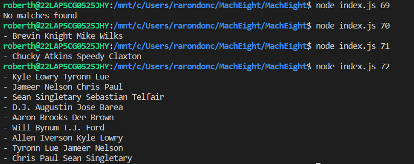

# Welcome to Mach Eigth

#### To make this project we try to follow up some steps:

#### 1) First we choose JavaScript like our language program, then we used two libraries or packages to make easier our development.
####    thats libraries are node_fecth and process (to be honest, we installed more than we need).

#### 2) According with the documentation, we first consume the [API](https://mach-eight.uc.r.appspot.com) to get the data.

#### 3) Designed an index.js file, to act like an app, I mean we made it executable and pass the hight number like a parameter in the console. Thast why we used the process package.

#### 4)After that we think in an algorithm that get the charactristics to be an O(log n), that is faster than O(N^2), and we choose the binary search    algorithm. 

#### 5) But before implement the algorithm we first ordered the data and them use the algorithm. 

#### 6) We use Linux like our OS. (Well this must be the first steps).;O)

#### To make this liltle app work:
#### <li>First you have to download, in your machine whit OS Linux, 
#### <li>You should have installed nodejs version 16.13.1, 
#### <li>Install the packages mentioned above. 
#### <li>A internet conection to consume the API and a desire to have fun.
#### <li>Execute `node index.js 69` from the linux console

#### Example of output:

#### Some pairs of players could be repeated, but is for the algorithm, thats due to data can appear in differents spaces during the search process.

#### I do my best, and thank you for the opportunity. I liked this proyect.
